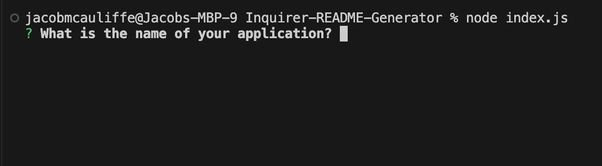
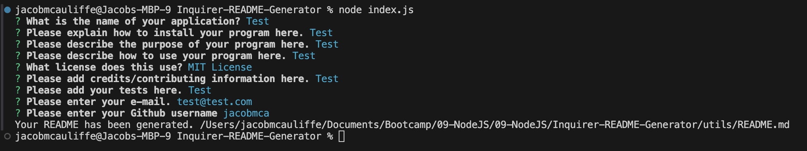

# Inquirer-README-Generator

## Table of Contents
* [Installation](#installation)
* [Description](#description)
* [Usage](#usage)
* [Contributions](#contributions)
* [License](#license)
* [Credits](#credits)
* [Tests](#tests)
* [Questions](#questions)
    
## Installation
To install, please clone this repository to your computer using the following steps:

1. Click the "Code" dropdown menu and copy the SSH URL.
2. Open your terminal and navigate to the directory you would like to clone this repository into.
3. Type "git clone <paste SSH URL>", replacing <paste SSH URL> with your copied SSH URL.
4. Press enter.

## Description
This is a node-based program that generates a professional README.md file based on the user's input. It utilizes the Inquirer package.

The program allows the user to input a title, installation steps, description, usage explanation license, credits, and a list of tests to be automatically populated into the README format. The user can also enter their e-mail and Github account, for population into a "Contact Me" section at the bottom of the page that includes links to the user's e-mail and Github profile.

The README program generates takes the same format as this README you are currently reading does.

A Table of Contents section is automatically created in the README, which takes the user to each section of the document.

For the license step, the user can select a license from a list provided by the program. Once selected, a license badge is added to the top of the README, and a notice populates in the License section explaining the license the application is covered under.

## Usage
To run the program, navigate to the Inquirer-README-Generator folder and enter "node index.js" into your local terminal. Follow the steps as prompted.

Once all the prompts have been answered, a message will be displayed stating the README has been generated. You will find it in the subdirectory "utils" in your Inquirer-README-Generator program.

Note - if you generate another README after creating your first one, it will overwrite the README that already exists in your utils folder.

[Please see this video demo.](https://www.youtube.com/watch?v=q-IHm4JOogA)

## Contributions
When contributing to this repository, please reach out to me via e-mail to discuss the change you would like to make first. I am open to ideas including new sections for the README, new functionalities for the program to perform with the README, or any other ideas that would make for a more useful tool.

## License
This project is licensed under the MIT License. For more information, please see the [MIT License](https://opensource.org/licenses/MIT).

## Credits
This program was created by Jacob McAuliffe for the UC Berkeley eDX Coding Boot Camp.

## Tests
In the future, I would like to incorporate other features to this README generator. Options for future versions include the ability to automatically upload screenshots, edit the Table of Contents, a section listing known bugs, and functionality to create multiple READMEs without overwriting the first one in the utils subdirectory.

## Questions
If you have further questions, you can reach me at [mcauliffemedia@gmail.com](mailto:mcauliffemedia@gmail.com).

GitHub Account: [jacobmca](https://github.com/jacobmca)
